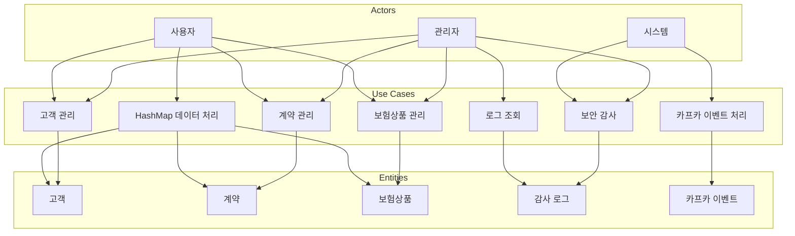
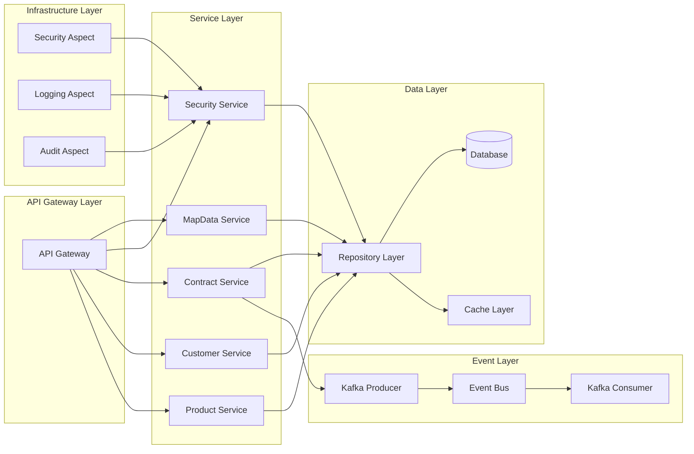
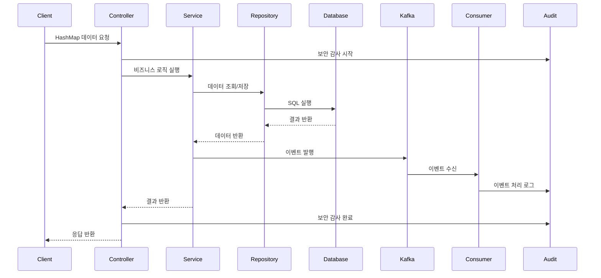

# Insurance Management System

보험 관리 시스템으로, HashMap 형태의 데이터를 처리할 수 있는 공통 로직과 보안 감사 기능을 제공합니다.


## 📋 목차
- [주요 기능](#주요-기능)
- [시스템 아키텍처](#시스템-아키텍처)
- [Use Case 다이어그램](#use-case-다이어그램)
- [서비스 아키텍처](#서비스-아키텍처)
- [데이터 플로우](#데이터-플로우)
- [사용 예시](#사용-예시)
- [보안 감사 기능](#보안-감사-기능)
- [기존 API와의 호환성](#기존-api와의-호환성)
- [프로젝트 구조](#프로젝트-구조)
- [실행 방법](#실행-방법)
- [주요 특징](#주요-특징)
- [보안 고려사항](#보안-고려사항)

## 주요 기능

### 1. HashMap 데이터 처리
- 모든 엔티티(Contract, Customer, InsuranceProduct)에 대해 HashMap으로 데이터를 받아 처리
- 유연한 데이터 구조 지원
- 타입 안전한 변환 로직

### 2. 보안 감사 시스템
- 모든 API 호출에 대한 자동 보안 감사 로그 기록
- IP 주소, 사용자 에이전트, 세션 정보 추적
- 실패한 요청에 대한 별도 로깅
- 보안 통계 및 분석 기능

### 3. 공통 API 엔드포인트
- `/api/map-data/{entityType}` - HashMap으로 엔티티 생성/조회
- `/api/map-data/{entityType}/{id}` - HashMap으로 엔티티 수정/삭제
- `/api/security/audit` - 보안 감사 로그 조회

## 🏗️ 시스템 아키텍처

```mermaid
graph TB
    subgraph "Client Layer"
        Web[웹 브라우저]
        Mobile[모바일 앱]
        API[API 클라이언트]
    end

    subgraph "Presentation Layer"
        RestAPI[REST API]
        GraphQL[GraphQL]
        Security[보안 필터]
    end

    subgraph "Business Layer"
        MapDataController[MapData Controller]
        SecurityAuditController[보안 감사 Controller]
        KafkaTestController[카프카 테스트 Controller]
        
        MapDataConverter[MapData Converter]
        SecurityAuditService[보안 감사 Service]
        ContractService[계약 Service]
        CustomerService[고객 Service]
        ProductService[상품 Service]
    end

    subgraph "Data Layer"
        JPA[JPA Repository]
        Kafka[Kafka]
        H2DB[(H2 Database)]
    end

    subgraph "Infrastructure Layer"
        SecurityAspect[보안 감사 AOP]
        LogAspect[로깅 AOP]
        AuditEntity[감사 엔티티]
    end

    Web --> RestAPI
    Mobile --> RestAPI
    API --> RestAPI
    
    RestAPI --> Security
    Security --> MapDataController
    Security --> SecurityAuditController
    Security --> KafkaTestController
    
    MapDataController --> MapDataConverter
    MapDataController --> ContractService
    MapDataController --> CustomerService
    MapDataController --> ProductService
    
    SecurityAuditController --> SecurityAuditService
    KafkaTestController --> ContractService
    
    ContractService --> JPA
    CustomerService --> JPA
    ProductService --> JPA
    SecurityAuditService --> JPA
    
    ContractService --> Kafka
    Kafka --> ContractEventConsumer[계약 이벤트 Consumer]
    
    JPA --> H2DB
    
    SecurityAspect --> SecurityAuditService
    LogAspect --> SecurityAuditService
    AuditEntity --> H2DB
```




## 👥 Use Case 다이어그램




## 🔄 서비스 아키텍처




## 📊 데이터 플로우



## 사용 예시

### 1. 고객 생성 (HashMap 사용)
```bash
POST /api/map-data/customer
Content-Type: application/json

{
  "data": {
    "name": "홍길동",
    "email": "hong@example.com",
    "phone": "010-1234-5678",
    "address": "서울시 강남구"
  },
  "requestType": "customer"
}
```

### 2. 계약 생성 (HashMap 사용)
```bash
POST /api/map-data/contract
Content-Type: application/json

{
  "data": {
    "customerName": "홍길동",
    "productName": "자동차보험",
    "startDate": "2024-01-01",
    "endDate": "2024-12-31"
  },
  "requestType": "contract"
}
```

### 3. 보험상품 생성 (HashMap 사용)
```bash
POST /api/map-data/insuranceproduct
Content-Type: application/json

{
  "data": {
    "name": "자동차보험",
    "description": "자동차 사고 보상",
    "premium": 500000.00,
    "coverage": "사고, 도난, 자연재해"
  },
  "requestType": "insuranceproduct"
}
```

### 4. 엔티티 조회
```bash
# 모든 고객 조회
GET /api/map-data/customer

# 특정 고객 조회
GET /api/map-data/customer/1
```

### 5. 엔티티 수정
```bash
PUT /api/map-data/customer/1
Content-Type: application/json

{
  "data": {
    "name": "홍길동",
    "email": "hong.updated@example.com",
    "phone": "010-9876-5432",
    "address": "서울시 서초구"
  }
}
```

### 6. 엔티티 삭제
```bash
DELETE /api/map-data/customer/1
```

## 보안 감사 기능

### 1. 보안 감사 로그 조회
```bash
# 모든 보안 감사 로그 조회
GET /api/security/audit

# 특정 사용자의 보안 감사 로그 조회
GET /api/security/audit/user/admin

# 특정 IP 주소의 보안 감사 로그 조회
GET /api/security/audit/ip/192.168.1.100

# 보안 통계 조회
GET /api/security/audit/statistics
```

### 2. 보안 감사 어노테이션 사용
```java
@SecurityAudit(action = "CREATE", resource = "CUSTOMER", includeRequestData = true)
public Customer createCustomer(Customer customer) {
    return customerService.createCustomer(customer);
}
```

### 3. 자동 기록되는 정보
- 사용자명 (인증된 사용자)
- 액션 (CREATE, READ, UPDATE, DELETE 등)
- 리소스 (엔티티 타입)
- 리소스 ID
- IP 주소 (프록시 환경 고려)
- 사용자 에이전트
- 세션 ID
- 요청 메서드 및 URL
- 요청 파라미터 (민감 정보 제외)
- 실행 시간
- 성공/실패 여부

## 기존 API와의 호환성

기존의 엔티티 기반 API도 그대로 사용 가능합니다:

```bash
# 기존 방식
POST /api/customers
Content-Type: application/json

{
  "name": "홍길동",
  "email": "hong@example.com",
  "phone": "010-1234-5678",
  "address": "서울시 강남구"
}
```

## 프로젝트 구조

```
src/main/java/com/insurance/
├── common/
│   ├── dto/
│   │   └── MapDataRequest.java          # HashMap 데이터 요청 DTO
│   ├── util/
│   │   └── MapDataConverter.java        # HashMap-엔티티 변환 유틸리티
│   ├── controller/
│   │   ├── MapDataController.java       # HashMap 데이터 처리 공통 컨트롤러
│   │   ├── SecurityAuditController.java # 보안 감사 로그 조회 컨트롤러
│   │   └── KafkaTestController.java     # 카프카 테스트 컨트롤러
│   ├── security/
│   │   └── WebRemoteAddrDetails.java    # IP 주소 및 사용자 에이전트 추출
│   ├── audit/
│   │   └── SecurityAuditLog.java        # 보안 감사 로그 엔티티
│   ├── service/
│   │   └── SecurityAuditService.java    # 보안 감사 서비스
│   ├── annotation/
│   │   └── SecurityAudit.java           # 보안 감사 어노테이션
│   └── aspect/
│       └── SecurityAuditAspect.java     # 보안 감사 AOP
├── domain/
│   ├── contract/
│   ├── customer/
│   └── insuranceProduct/
├── Global/
│   └── kafka/
│       ├── ContractEventProducer.java   # 카프카 프로듀서
│       └── ContractEventConsumer.java   # 카프카 컨슈머
└── InsuranceApplication.java
```

## 실행 방법

1. 프로젝트 빌드:
```bash
./gradlew build
```

2. 애플리케이션 실행:
```bash
./gradlew bootRun
```

3. H2 데이터베이스 콘솔 접속:
   - URL: http://localhost:8080/h2-console
   - JDBC URL: jdbc:h2:mem:testdb
   - Username: sa
   - Password: (비어있음)

## 주요 특징

1. **유연한 데이터 구조**: HashMap을 사용하여 다양한 형태의 데이터를 받을 수 있습니다.
2. **타입 안전성**: MapDataConverter를 통해 안전한 타입 변환을 제공합니다.
3. **확장성**: 새로운 엔티티 타입을 쉽게 추가할 수 있습니다.
4. **기존 API 호환성**: 기존 엔티티 기반 API와 함께 사용 가능합니다.
5. **공통 응답 형식**: 모든 API 응답이 일관된 형식으로 반환됩니다.
6. **보안 감사**: 모든 API 호출에 대한 자동 보안 감사 로그 기록
7. **IP 추적**: 프록시 환경을 고려한 정확한 IP 주소 추출
8. **성능 모니터링**: API 실행 시간 측정 및 기록
9. **보안 통계**: 보안 이벤트에 대한 통계 및 분석 기능
10. **이벤트 기반 아키텍처**: Kafka를 통한 비동기 이벤트 처리

## 보안 고려사항

1. **민감 정보 보호**: 비밀번호, 토큰 등 민감한 정보는 로그에서 제외됩니다.
2. **IP 주소 추출**: 프록시 환경에서도 정확한 클라이언트 IP를 추출합니다.
3. **세션 추적**: 사용자 세션 정보를 추적하여 보안 분석에 활용합니다.
4. **실패 로깅**: 실패한 요청에 대해서도 별도로 로깅하여 보안 위협을 탐지합니다. 